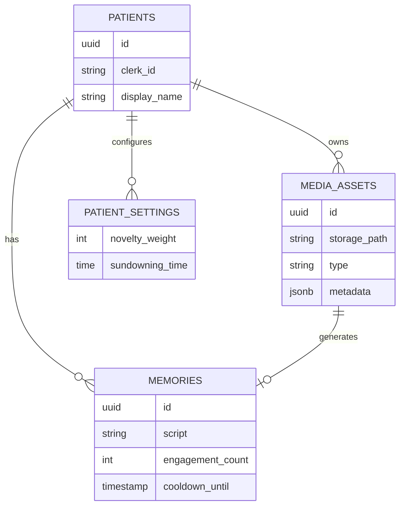

# System Architecture

## 1. High-Level Overview

Echo Adaptive is a Progressive Web App (PWA) built on a modern serverless stack. It leverages Edge caching for media and tailored AI services for content generation.

## 2. Technology Stack

- **Frontend**: Next.js 16 (App Router), React, TailwindCSS.
- **Database**: Supabase (PostgreSQL) with `pgvector` (future proofing).
- **Auth**: Clerk (Identity Management).
- **Storage**: Supabase Storage (S3-compatible).
- **AI Services**:
  - **Vision**: OpenAI GPT-4o (Image analysis).
  - **Voice**: ElevenLabs (Narration synthesis).
- **Deployment**: Vercel.

## 3. Data Flow

### 3.1. Media Ingestion Pipeline

1.  **Upload**: User uploads file via `SettingsPage`.
2.  **Storage**: File saved to Supabase Storage bucket `media-assets`.
3.  **Optimization**: `publicUrl` generated.
4.  **Analysis**:
    - Trigger: Client calls `/api/analyze-media`.
    - Process: OpenAI analyzes image -> Returns JSON (Summary, People, Date).
    - Fallback: Default metadata if AI fails.
5.  **Persistence**:
    - Insert into `media_assets` table.
    - Insert into `memories` table (linked record).

### 3.2. Feed Delivery

1.  **Auth**: Client authenticates via Clerk -> Token passed to Supabase Client.
2.  **Query**: `PatientView` fetches `memories` (Status = 'approved').
3.  **RLS**: Database filters rows where `patient_id` matches authenticated user.
4.  **Ranking** (Planned): Recency + Algorithm Scores.

## 4. Database Schema (Simplified)

## 5. Security Architecture

- **Authentication**: Clerk handles sessions. JWT Templates used to authenticate with Supabase.
- **Authorization**: Supabase Row-Level Security (RLS) policies enforce data isolation per `patient_id`.
- **Encryption**: Data at rest (Supabase), Data in transition (TLS 1.3).
